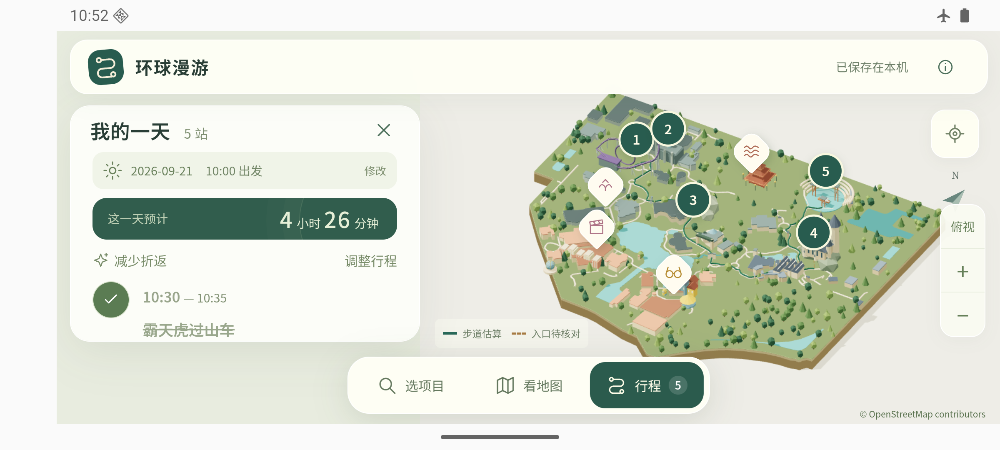

# 环球漫游 · 北京环球影城

[](https://github.com/RainbowLion0320/UniversalStudiosMap/actions/workflows/ci.yml)
[](LICENSE)
[](https://github.com/RainbowLion0320/UniversalStudiosMap/releases/latest)

把想玩的项目，连成自己的一天。用 Blender 制作的 Low Poly 微缩园区地图，选择项目、安排顺序、估算步行与排队时间。支持网页和 Android，界面以地图为主，清单按需展开。

**[下载安卓 APK](https://github.com/RainbowLion0320/UniversalStudiosMap/releases/latest)** · [使用说明](docs/android.md) · [反馈问题](https://github.com/RainbowLion0320/UniversalStudiosMap/issues)



© OpenStreetMap contributors，地理数据采用 [ODbL](https://www.openstreetmap.org/copyright)。独立、非官方项目，与北京环球度假区及相关品牌无隶属或背书关系。

## 能做什么

- Low Poly 3D 园区：城堡、过山车、侏罗纪山体、宝塔等地标，可旋转、缩放、平移和俯视。
- 「选项目 / 看地图 / 行程」三个入口；搜索、分区筛选、加入行程，复杂设置按需展开。
- 按 OSM 步道计算距离与时间，可减少折返、手动排序、调整每站排队和体验时间。
- 演出场次与闭园时间提示；只有当天且抓取不超过 15 分钟的数据才能作为实时估算使用。
- 行程自动保存，完成打卡，网页导出 Markdown，Android 使用系统分享。
- APK 内置模型、项目展示信息和路网，首次断网也能规划；联网可更新排队与演出。
- 横屏清单靠边，竖屏集中阅读；支持 Android 返回键。无需注册。

## 安装 Android 版

到 [Releases](https://github.com/RainbowLion0320/UniversalStudiosMap/releases) 下载 `universal-wander-*.apk`，传到手机后打开安装。如系统提示，允许当前文件来源安装应用。最低 Android 8.0，WebView 需支持 WebGL 2。

下载页同时提供 SHA-256 文件。在同一目录校验：

```sh
shasum -a 256 -c universal-wander-1.0.0.apk.sha256
```

同一来源的正式签名版本可以覆盖安装；卸载会清除本机行程。CI 的调试包与正式 Release 签名不同。

已在 Android 16 ARM64 模拟器验证离线首次安装、横竖屏切换、返回键、系统分享和覆盖安装保留数据，尚未覆盖实体手机。见 [验证记录](docs/android-validation.md)。

## 本地运行

需要 Node.js **22.12+**、Python 3。首次准备项目清单需要联网；OSM 路网和 3D 模型已随源码提供。

```sh
git clone https://github.com/RainbowLion0320/UniversalStudiosMap.git
cd UniversalStudiosMap
npm ci
npm run data:catalog
npm run dev
```

打开 http://127.0.0.1:5173 。`data:catalog` 只从 ThemeParks.wiki 获取应用所需清单，不批量查询 Overpass；`data:fetch` 是完整调研抓取，日常运行不需要执行。

```sh
npm test
npm run build
npm run preview   # http://127.0.0.1:4173
```

Vite 开发/预览服务器提供刷新接口。构建后的静态目录可以显示随包地图与清单，但纯静态托管没有网页刷新 API；APK 使用原生网络能力向原始服务刷新。网页版没有 Service Worker。

## 构建 APK 与发版

需要 JDK 21、Android SDK 36 与 Build Tools 36.0.0，不需要安装 Unity。

```sh
npm run android:release
```

产物：`output/release/universal-wander-<version>.apk` 与 `.apk.sha256`。构建脚本会生成/复用本机私有签名、构建、对齐并验证 APK。**备份签名目录** `~/.local/share/universal-wander/signing/`，后续升级必须复用同一密钥。

GitHub Actions 自动运行测试并生成调试 APK；正式签名不交给公共 CI。维护者通过本地发布脚本上传正式 APK 到 Release。完整步骤见 [发版流程](docs/releasing.md)。

## 模型与代码

| 内容 | 位置 |
| --- | --- |
| 可编辑 Blender 场景 | [art/universal-beijing.blend](art/universal-beijing.blend) |
| 模型设计、参考与重建 | [art/README.md](art/README.md) |
| Three.js 三维地图 | `src/map3d.js` |
| 步道路由与行程估算 | `src/planner.js` |
| 界面 / 数据访问 | `src/main.js` / `src/data-service.js` |
| 本地刷新服务 | `server/park-api.js` |
| 数据来源与调研 | [data/README.md](data/README.md) / [docs/research.md](docs/research.md) |

重建模型：`blender -b --factory-startup --python art/build_park.py`，已在 Blender 5.2.0 LTS 验证。模型不依赖商业素材或官方图片纹理。

## 路线与数据边界

绿色路线沿已收录 OSM 步道计算；棕色虚线连接项目坐标与最近步道节点，入口需现场核对。断路或入口距离过远时不补造路线。不含入园、离园步行；休息统一预留在末尾，自动排序不保证排队与演出综合最优。

建筑高度、装饰、轨道为艺术化设计。中文名称与体验时长为本地编辑资料；实时排队无法预测未来日期。最终开放状态、场次与临时封路以园区当日信息为准。

Powered by [ThemeParks.wiki](https://themeparks.wiki/)。API 原始响应和缓存不作为开源数据集分发；已有清单可离线运行，刷新依赖外部服务的可用性。

## 开源与参与

原创代码、文档与原创美术部分采用 [MIT](LICENSE)；OSM 数据及派生地理数据适用 ODbL，第三方依赖和主题相关权利另见 [第三方说明](THIRD_PARTY_NOTICES.md)。MIT 不覆盖第三方 API 数据或商标。

欢迎 [Issue](https://github.com/RainbowLion0320/UniversalStudiosMap/issues) 和 Pull Request。参见 [贡献指南](CONTRIBUTING.md) 与 [安全反馈](SECURITY.md)。
